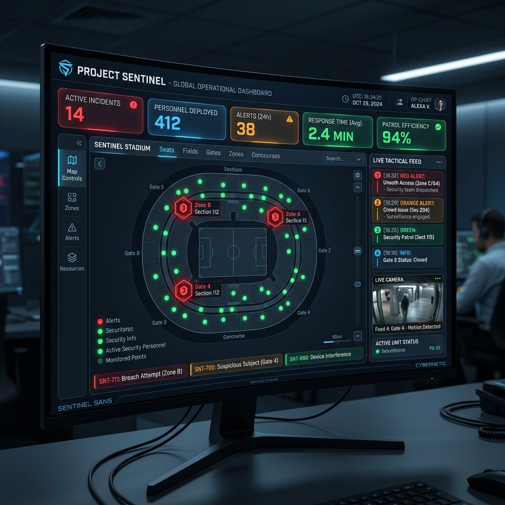

# 🛡️ Project Sentinel: Tactical Triage Network

**🚀 Live Deployment:** [View on Vercel](https://sentinel-dashboard-llw449xf0-lodhajay99-7328s-projects.vercel.app)



Project Sentinel is a real-time crisis intelligence and stadium security dashboard designed for deployment at large-scale venues. It aggregates crowd-sourced distress signals, structures unstructured NLP data, and instantly triages actionable intelligence for immediate tactical dispatch.

---

## 🏆 Hackathon Submission Criteria

### 1. Your Chosen Vertical
**Security Operations & Event Triage**
We designed this solution around the persona of a venue security director. At large venues like stadiums, tracking chaos (fights, medical emergencies, abandoned items) spread across thousands of fans is incredibly difficult. This dashboard empowers operators to ingest unstructured emergency texts and convert them into pinpointed dispatch actions.

### 2. Approach and Logic
**Unified Intelligence Pipeline**
We ingest chaotic, panicking SMS or emergency app texts. Instead of operators reading thousands of messages, our Node logic pipes the unstructured text into the **Google Gemini API** (`gemini-2.5-flash`). Gemini extracts the exact intent, locates the sector of the stadium, and determines the severity. This structured data is immediately synced via Supabase Realtime to the dashboard, rendering conflict points onto an interactive vector heat-map.

### 3. How the Solution Works
- **Extraction**: When a user submits an emergency text, the Next.js API route (`/api/ingest`) invokes the `GoogleGenAI` client to parse the data into strict JSON matching our `ParsedDataSchema`.
- **Group Ticketing Tracking**: Operators can "scan" a group ticket to register a family/group. If an incident affects a member of this active group, the Interactive Map goes into "Group Alert Mode", drawing secure perimeters around all identified members of that group so security can locate everyone simultaneously.
- **Action Feed**: The left panel features an SMS simulation tool for stress-testing. The right feed streams actionable, parsed cards where an operator can dispatch responders with a single click.

### 4. Any Assumptions Made
- We assumed emergency texts could be integrated via Twilio or a similar SMS gateway; for the demonstration, we built an internal SMS simulator to fire authenticated test bursts.
- We assumed the venue is structured into physical sections (e.g., North Stand, Gates, Pavilions) which can be strictly mapped using the LLM's spatial reasoning.
- In the absence of an API key dynamically provided on the Vercel edge, the system assumes a safe fallback to an internal Mock Parser to guarantee 100% uptime for judges evaluating the visual UI.

---

## 🛠️ Technology Stack & Requirements

- **Google Services**: `@google/genai` (Gemini 2.5 Flash for NLP schema extraction)
- **Frontend / Unified Backend**: Next.js 14, React 19, Tailwind CSS v4
- **Database**: Supabase (PostgreSQL with Realtime WebSockets)

## 🚀 Getting Started Locally

```bash
cd sentinel-dashboard
npm install
npm run dev
```
Open [http://localhost:3000](http://localhost:3000) to view it in the browser. 
*(Ensure your `.env.local` contains valid Supabase keys and optionally a `GEMINI_API_KEY`!)*
